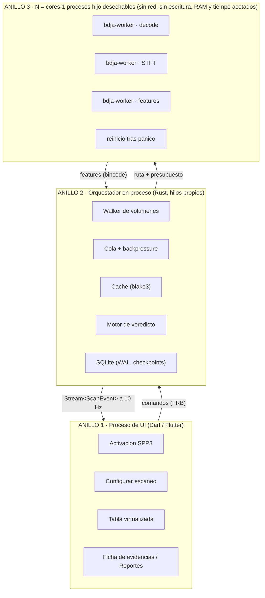
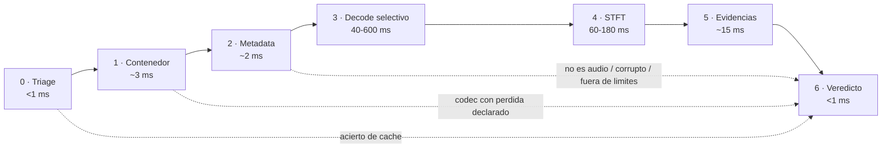

# BDJ Studio Audio Analyzer — Plan de arquitectura v1.0

> Documento v1.0 · 12 de septiembre de 2026 · alcance v1 = motor de veredicto + escaneo masivo. Plataformas: Windows 10+ / macOS 12+.
> Ruta del proyecto: `Aplicacion_para_DJs\BDJ_Studio_Audio_Analyzer`. Los diagramas van en Mermaid; hay una versión navegable publicada como artifact en Claude.

Control de calidad de audio para DJs: detecta cuándo un WAV, FLAC o AIFF que se declara lossless contiene evidencia de haber pasado por MP3, AAC u otra fuente con pérdida. Escaneo de carpetas, discos y USB completos. 100% offline, sin GPU, licenciado con BDJ Studio License.

## 0. Qué promete el producto y qué no

Esta es la decisión más importante del proyecto, porque define la redacción de cada veredicto y el riesgo legal de la app.

**Lo que la app afirma:** que el audio *contenido* en el archivo presenta características compatibles con una codificación con pérdida previa, con un nivel de confianza medido y una lista de evidencias.

**Lo que la app nunca afirma:** que conoce el historial del archivo, que el proveedor engañó deliberadamente, ni que un veredicto sea prueba. No existe prueba matemática del origen de un PCM.

Regla de producto

Ante duda, la app se abstiene. Un falso positivo que haga a un DJ reclamarle a un sello por un master legítimamente band-limited (vinilo, cinta, grabación de los 60, master con lowpass intencional) destruye la credibilidad del producto mucho más rápido que un falso negativo. El estado Inconcluso es un resultado de primera clase, no un fallo.

El posicionamiento comercial es *«verifica la calidad real de tus remixes antes de comprarlos, venderlos o reproducirlos»*, conectado directamente con el catálogo de BDJ LATAM. No compite con iZotope RX ni con Voxengo SPAN: compite en **veredicto claro, escaneo de bibliotecas enteras y cero configuración**.

## 01. Requisitos y presupuestos medibles

Todo requisito no funcional lleva número. Lo que no se puede medir no entra en los criterios de aceptación ni en los gates de CI.

### Equipo objetivo (el más humilde que debe funcionar bien)

CPU2 núcleosx86-64 con SSE4.2; sin exigir AVX2 (ruta escalar de respaldo)

RAM4 GBRSS de la app \< 250 MB en escaneo de 50 000 archivos

GPUNingunagráfica integrada; no se usa GPU para nada del análisis

### Presupuestos de rendimiento (objetivos duros)

| Escenario                                              | Objetivo                  | Medición                                                |
|--------------------------------------------------------|---------------------------|---------------------------------------------------------|
| Archivo suelto arrastrado, WAV 44,1 kHz/16 bits, 4 min | ≤ 900 ms                  | de `drop` a veredicto en pantalla, SSD, equipo objetivo |
| Mismo archivo en FLAC (decodificación más costosa)     | ≤ 1,4 s                   | idem                                                    |
| Lote de 1 000 archivos mixtos en SSD                   | ≤ 6 min                   | 4 núcleos, modo normal                                  |
| Lote de 50 000 archivos (biblioteca completa)          | ≤ 5 h                     | reanudable; progreso persistente cada 200 archivos      |
| Re-análisis de un lote ya escaneado sin cambios        | ≤ 2 % del tiempo          | acierto de caché por `(blake3 parcial, tamaño, mtime)`  |
| Latencia de UI durante escaneo                         | 60 fps, 0 frames \> 32 ms | ningún trabajo de análisis en el isolate de UI          |
| Consumo en «modo silencioso»                           | ≤ 25 % CPU total          | para que la PC siga usable y no se desgaste el equipo   |
| Arranque en frío hasta pantalla usable                 | ≤ 1,2 s                   | incluida verificación de licencia offline               |
| Tamaño del instalador                                  | ≤ 45 MB                   | sin modelos de IA en la v1                              |

### Requisitos funcionales de la v1

| ID    | Requisito                                                                                                | Nota                                                 |
|-------|----------------------------------------------------------------------------------------------------------|------------------------------------------------------|
| RF-01 | Analizar archivo suelto por arrastre o diálogo                                                           | uno o varios a la vez                                |
| RF-02 | Analizar carpeta recursiva                                                                               | arrastre de carpeta incluido                         |
| RF-03 | Enumerar unidades del sistema y permitir elegir cuáles escanear                                          | internas, externas, USB; red excluida por defecto    |
| RF-04 | Escaneo reanudable de grandes volúmenes con progreso e ETA                                               | sobrevive a cierre de la app y a desconexión del USB |
| RF-05 | Verdad del contenedor: formato, códec, sample rate, bit depth, canales, duración, bitrate real           | por parseo real, nunca por extensión                 |
| RF-06 | Veredicto de procedencia en 6 estados con confianza y evidencias legibles                                | núcleo del producto                                  |
| RF-07 | Métricas de calidad: true peak, clipping, DC offset, LUFS integrado, rango dinámico, correlación estéreo | informativas, no de procedencia                      |
| RF-08 | Tabla virtualizada con filtro por veredicto, orden por columnas y «mostrar solo sospechosos»             | cientos de miles de filas                            |
| RF-09 | Ficha por archivo con desglose de evidencias y su peso                                                   | explicabilidad obligatoria                           |
| RF-10 | Exportar reporte CSV, JSON y PDF («Verify Remix»)                                                        | para reclamar al proveedor                           |
| RF-11 | Activación por licencia SPP3 al inicio, con HWID visible y copiable                                      | igual que Sample Pad                                 |
| RF-12 | Funcionamiento íntegro sin conexión a internet                                                           | verificado por test que prohíbe sockets              |

#### Fuera de la v1 (declarado, no olvidado)

Espectrograma interactivo y modos Analyzer/Forensic (v1.1), comparación A/B de dos archivos (v1.1), clasificador ONNX de refuerzo (v1.2, opt-in), detección de BPM/tonalidad, edición o reparación de audio, sincronización en la nube, Linux, móvil.

## 02. Decisiones de arquitectura

Cada decisión con su alternativa rechazada. Estas quedan escritas en `docs/adr/` del repo para que dentro de un año se sepa por qué.

| ADR | Decisión                                                                                         | Por qué                                                                                                                                                                                                                                                         | Rechazado                                                                                                                                                          |
|-----|--------------------------------------------------------------------------------------------------|-----------------------------------------------------------------------------------------------------------------------------------------------------------------------------------------------------------------------------------------------------------------|--------------------------------------------------------------------------------------------------------------------------------------------------------------------|
| 01  | Motor nativo en **Rust**, no C++                                                                 | Reutiliza exactamente la arquitectura probada de Search Pro (workspace de crates + FFI). Seguridad de memoria en la parte que más importa: parsear archivos de audio no confiables de un USB ajeno. `cargo`, `clippy`, `cargo-fuzz` y `criterion` sin fricción. | C++20 como en Stems Music: allí se justifica por ONNX Runtime; aquí no hay modelo y el coste de seguridad no se paga.                                              |
| 02  | UI en **Flutter** + `flutter_rust_bridge` 2.x                                                    | Consistencia total con la suite: misma UI, mismo `bdj_license_core` en Dart, mismos workflows de empaquetado, una sola base para Windows y macOS.                                                                                                               | Tauri/React: rompe la consistencia de la suite y obliga a reimplementar licenciamiento y activación.                                                               |
| 03  | Decodificación con **Symphonia 0.6** (Rust puro)                                                 | Sin FFmpeg: sin GPL, sin DLLs enormes, sin superficie de ataque de C. Cubre WAV, AIFF, FLAC, ALAC, MP3, AAC-LC, Vorbis, PCM, ADPCM, MP4/CAF/MKV.                                                                                                                | FFmpeg enlazado: +40 MB, licencias complicadas y CVEs constantes. Se reserva como plugin opcional solo si se decide soportar Opus/WavPack/APE.                     |
| 04  | **Sin servidor.** Todo el análisis y la licencia son locales                                     | Requisito del producto y ventaja competitiva: el DJ analiza material que no quiere subir a ningún sitio.                                                                                                                                                        | Cola en la nube: rechazada ya en Stems Music por el mismo motivo.                                                                                                  |
| 05  | Veredicto por **DSP determinista con fusión de evidencias**; la IA queda opt-in y fuera de la v1 | Reproducible, explicable, auditable y rápido en 2 núcleos. Un veredicto que no se puede explicar no sirve para reclamarle a un proveedor.                                                                                                                       | CNN/LSTM como motor principal: sube el instalador, exige calibración con dataset grande y convierte el veredicto en caja negra.                                    |
| 06  | **Decodificación en procesos hijo aislados** (`bdja-worker`)                                     | Un archivo malformado de un USB no debe poder tumbar la app ni escalar privilegios. Además da cancelación instantánea, límite de RAM por archivo y timeout por archivo.                                                                                         | Todo en el mismo proceso: más rápido de escribir, pero un pánico o un bucle en un decoder mata la sesión de escaneo de 50 000 archivos.                            |
| 07  | **SQLite** (`rusqlite` con SQLite embebido, WAL) para catálogo, caché y checkpoints              | Escaneo reanudable, filtros y orden sobre cientos de miles de filas sin cargarlas en RAM, reportes reproducibles.                                                                                                                                               | JSON en disco: no soporta consulta ni reanudación; índice binario propio: complejidad innecesaria, aquí no hay requisito de tecleo instantáneo como en Search Pro. |
| 08  | **Análisis por muestreo estratificado**, no del 100 % del audio                                  | Es lo que hace posible el presupuesto de tiempo. 120-240 ventanas elegidas por energía y distribuidas en toda la pista dan la misma señal que analizar 10 millones de muestras.                                                                                 | STFT completo de toda la pista: 20-40× más lento sin mejora medible del veredicto (queda disponible en modo Forensic bajo demanda).                                |
| 09  | **Sin privilegios de administrador**                                                             | Leer archivos para analizarlos no requiere elevación. A diferencia de Search Pro, aquí no se lee la MFT ni el USN Journal.                                                                                                                                      | Servicio elevado: superficie de ataque y fricción de instalación que el producto no necesita.                                                                      |
| 10  | El motor **exige un token de capacidad** emitido por la capa Dart tras validar la licencia       | Que el `.dll`/`.dylib` del motor no sea utilizable por sí solo si alguien lo extrae del instalador.                                                                                                                                                             | Motor abierto: regalaría la parte valiosa del producto.                                                                                                            |

## 03. Stack tecnológico completo

Versiones a fijar en `Cargo.lock` y `pubspec.lock`. Nada de rangos abiertos en dependencias que toquen audio o criptografía.

### Motor nativo

| Pieza               | Tecnología                                  | Papel                                                                       |
|---------------------|---------------------------------------------|-----------------------------------------------------------------------------|
| Lenguaje            | Rust 1.8x, edition 2021                     | `panic = "abort"` en workers, `lto = "fat"`, `codegen-units = 1` en release |
| Demux + decode      | symphonia 0.6 (`all-codecs`, `all-formats`) | WAV, AIFF, FLAC, ALAC, MP3, AAC-LC, Vorbis, MP4, CAF                        |
| FFT                 | realfft 3 sobre rustfft 6                   | FFT real, planes cacheados y reutilizados entre archivos                    |
| Remuestreo          | rubato 0.15                                 | solo cuando hace falta normalizar a una rejilla común                       |
| Loudness            | ebur128 0.1 (Rust puro)                     | LUFS integrado/corto y true peak conforme a EBU R128                        |
| Paralelismo         | rayon 1 + crossbeam-channel 0.5             | pool acotado, cola con backpressure                                         |
| Recorrido de disco  | jwalk 0.8                                   | walk paralelo con orden estable y control de profundidad                    |
| Hash                | blake3 1                                    | huella parcial (primeros y últimos 2 MB + tamaño) para caché y dedupe       |
| Persistencia        | rusqlite 0.32 (`bundled`)                   | SQLite embebido, WAL, sin dependencia del sistema                           |
| Serialización       | serde 1 + bincode 2 + serde_json 1          | bincode para IPC con workers, JSON para reportes                            |
| Errores y trazas    | thiserror 2, tracing 0.1 + tracing-appender | log rotativo local, sin telemetría                                          |
| E/S                 | memmap2 0.9                                 | lectura de cabeceras y bloques sin copias                                   |
| Plataforma          | windows 0.58 / core-foundation 0.10         | enumeración de volúmenes, rutas largas, DiskArbitration                     |
| Higiene de secretos | zeroize 1                                   | borrado del token de capacidad en memoria                                   |
| Puente              | flutter_rust_bridge 2.13                    | generación de FFI y streams hacia Dart                                      |

### Aplicación

| Pieza                 | Tecnología                             | Papel                                                   |
|-----------------------|----------------------------------------|---------------------------------------------------------|
| UI                    | Flutter 3.2x (desktop)                 | Windows + macOS, un solo código                         |
| Estado                | Riverpod 2 + clean architecture        | mismo patrón que Stems Music y Search Pro               |
| Licencia              | bdj_license_core 1.0 (path dependency) | SPP3 + HWID V2 + jerarquía de claves Ed25519            |
| Almacenamiento seguro | DPAPI (Win) / Keychain (macOS)         | vía el `secure_storage_impl` ya escrito para Search Pro |
| Tabla virtualizada    | widget propio (reuso de Search Pro)    | `virtualized_table.dart` ya resuelve 10⁶ filas          |
| Gráficas              | CustomPainter propio                   | sin librerías de charts: control total y cero peso      |
| Reportes PDF          | pdf + printing                         | generación local del reporte «Verify Remix»             |
| i18n                  | `app_strings.dart` (es/en)             | mismo enfoque que Search Pro, sin dependencia extra     |

### Herramientas, calidad y distribución

| Área                      | Herramientas                                                                       |
|---------------------------|------------------------------------------------------------------------------------|
| Estilo y lint             | rustfmt, clippy (`-D warnings`), dart analyze con very_good_analysis               |
| Seguridad de dependencias | cargo-deny (licencias + avisos), cargo-audit, SBOM CycloneDX                       |
| Pruebas                   | cargo test, proptest, insta (golden), cargo-fuzz, criterion, flutter test          |
| Análisis estático         | SonarQube (ya en uso en la suite) + cobertura con cargo-llvm-cov                   |
| Contratos                 | `tools/verify_contracts.py` adaptado de Stems Music (FFI, enums, huérfanos)        |
| Empaquetado               | Inno Setup 6 (Win), create-dmg + notarytool (macOS)                                |
| Firma                     | Certificado EV de Windows; Developer ID + hardened runtime + notarización de Apple |
| CI                        | GitHub Actions, matriz windows-latest / macos-14 (arm64 + x86_64)                  |

## 04. Topología de procesos

Tres anillos: la UI nunca bloquea, el orquestador nunca decodifica, y los workers son desechables.



El anillo 3 es el que toca bytes no confiables. Si un archivo lo mata, el orquestador marca ese archivo como `DECODE_FAILED`, levanta otro worker y el escaneo continúa.

Reglas de la topología, no negociables:

- El isolate de UI de Dart **nunca** ejecuta DSP. Recibe un `Stream` de eventos con *throttling* a 10 Hz para no saturar el rebuild de Flutter.
- El orquestador vive en el proceso de la app pero en sus propios hilos; mantiene la cola, la caché y SQLite.
- Cada worker recibe una ruta y un presupuesto (`max_bytes`, `max_ms`, `max_windows`) y devuelve un vector de *features*. No decide nada: el veredicto se calcula en el anillo 2 para que sea auditable y versionable con un único número de `engine_rev`.
- IPC: `stdin`/`stdout` con marcos de longitud + bincode. Cero sockets, cero puertos.

## 05. Workspace Rust: crates y responsabilidades

Un crate por responsabilidad, con la misma convención de nombres de Search Pro (`bdj_search_*` → `bdja_*`). Las dependencias apuntan siempre hacia abajo.

| Crate        | Responsabilidad                                                                                                                                                    | Depende de        | No debe conocer  |
|--------------|--------------------------------------------------------------------------------------------------------------------------------------------------------------------|-------------------|------------------|
| bdja_core    | Tipos del dominio: `Verdict`, `Evidence`, `FormatFacts`, `QualityMetrics`, `EngineRev`, errores, configuración                                                     | —                 | E/S, FFI, SQLite |
| bdja_decode  | Symphonia: identificación real del contenedor y códec, metadata forense, decodificación a `f32`, *seek* a ventanas, límites duros                                  | core              | veredicto, UI    |
| bdja_dsp     | STFT, ventanas, bandas, estimación de corte, agujeros espectrales, rejilla de bloques, pre-eco, piso de ruido, LSB, clipping, true peak, LUFS, correlación estéreo | core              | archivos, rutas  |
| bdja_verdict | Fusión de evidencias por log-verosimilitud, calibración por códec y sample rate, política de abstención, texto explicativo                                         | core              | E/S, DSP interno |
| bdja_scan    | Enumeración de volúmenes, walk paralelo, filtros, dedupe, cola con backpressure, checkpoints, throttling, cancelación                                              | core, store       | DSP, FFI         |
| bdja_store   | Esquema SQLite, migraciones, caché por huella, consultas paginadas y ordenadas, exportadores CSV/JSON                                                              | core              | DSP, scan        |
| bdja_worker  | Binario del proceso hijo: lee marco, decodifica, calcula features, escribe marco. Sin estado global                                                                | core, decode, dsp | store, scan, FFI |
| bdja_ipc     | Marcos de longitud, spawn, supervisión, timeout, reinicio, límites de RAM por plataforma                                                                           | core              | DSP              |
| bdja_ffi     | Superficie `flutter_rust_bridge`: comandos, streams, *gate* de capacidad, diagnósticos                                                                             | todos             | —                |
| bdja_cli     | Binario headless para CI, calibración y usuarios avanzados: `bdja analyze`, `bdja scan`, `bdja calibrate`                                                          | todos menos ffi   | —                |

Por qué existe bdja_cli desde la fase 1

Sin CLI no hay forma sana de calibrar umbrales sobre miles de archivos, ni de meter el motor en CI, ni de reproducir un bug que reporte un DJ. El CLI es una herramienta de ingeniería antes que una función del producto, y se distribuye dentro del instalador sin documentarlo en la UI.

## 06. Pipeline de análisis

Siete etapas con salida temprana en las tres primeras. El 70 % de los archivos de una biblioteca se resuelven sin llegar a la FFT.



**Presupuesto de muestreo (etapas 3-4):** 192 ventanas de 8192 muestras, estratificadas por percentil de
energia de banda alta, repartidas en 12 tramos de la pista, descartando silencio y fade.

Coste medido sobre el equipo objetivo para un archivo de 4 minutos. La decodificación domina; de ahí que se decodifiquen solo los tramos que se van a analizar, usando *seek*.

### Detalle de las etapas

| Etapa                | Qué hace                                                                                                                        | Decisiones finas                                                                                                                                        |
|----------------------|---------------------------------------------------------------------------------------------------------------------------------|---------------------------------------------------------------------------------------------------------------------------------------------------------|
| 0 · Triage           | Tamaño, mtime, extensión, huella parcial blake3; consulta de caché                                                              | Límites duros: 0 \< tamaño ≤ 2 GB, duración ≤ 3 h. Archivos de 0 bytes y \> límite se etiquetan, no se abren.                                           |
| 1 · Contenedor       | Symphonia identifica contenedor y códec reales por *magic bytes* y cabeceras                                                    | Si la extensión dice `.wav` y dentro hay un MP3 en un chunk, o un FLAC renombrado, eso ya es una evidencia (`E13`).                                     |
| 2 · Metadata forense | Tags, cabecera Xing/LAME residual, chunks inesperados (`ID3` dentro de WAV), software de encode declarado                       | Señal débil pero baratísima. Un WAV con tag `LAME3.100` es casi confesión escrita.                                                                      |
| 3 · Decode selectivo | *Seek* a los 12 tramos y decodificación solo de esos bloques a `f32`; canales conservados                                       | Si el códec no permite *seek* preciso (algunos FLAC sin seektable), se decodifica en streaming descartando lo que no se usa, con presupuesto de tiempo. |
| 4 · STFT             | Hann de 8192 con solape 50 % sobre las ventanas elegidas; además una pasada de 1024 para resolución temporal (pre-eco, bloques) | Dos resoluciones porque las evidencias de frecuencia y las de tiempo no se ven bien en la misma ventana.                                                |
| 5 · Evidencias       | Cálculo de las 14 evidencias del catálogo, cada una con valor, incertidumbre y flag de aplicabilidad                            | Una evidencia puede declararse *no aplicable* (p. ej. correlación estéreo en un mono) y entonces no entra en la fusión.                                 |
| 6 · Veredicto        | Fusión, calibración, abstención, redacción                                                                                      | Determinista y versionado: mismo archivo + misma `engine_rev` = mismo veredicto, byte a byte.                                                           |

## 07. Catálogo de evidencias

La conclusión técnica más importante de la investigación previa: **el corte espectral solo no basta**. Un clasificador entrenado solo con el corte pasa del 99 % al 28-81 % de acierto en cuanto el encoder cambia su filtro, mientras que las señales de *huecos* y coeficientes anulados se mantienen. Por eso aquí hay 14 evidencias y no una.

```text
 0 dB ┤━━━━━━━━━━━━━━━━━━━━━━━━━━━━━━━━━━━━━┓
      │   ambos espectros coinciden         ┃
      │   hasta ~15 kHz                     ┃
  -40 ┤                            ╲        ┃
      │                      lossless       ┃
      │                   (roll-off         ┃
  -60 ┤                    suave)  ╲        ┃ ← brick-wall a 16,0 kHz
      │                              ╲      ┃    MP3 128 kbps
  -90 ┤                                ╲    ┃    pendiente > 60 dB/oct  → E02
      │                                  ╲  ┃
 -120 ┤                                    ╲┗━━━━━━━━━━━━━━━━━━━━
      └────┬──────┬──────┬──────┬──────┬──────┬──────┬──────┬────
           0     4k     8k    12k    16k    18k    20k  22,05 kHz
```

Cortes de referencia: MP3 128 kbps = 16 kHz, 192 = 19 kHz, 256 = 20 kHz, 320 entre 16 y 20,5 kHz.
AAC y LAME V0 suelen aplicar un *shelf* suave o ningun lowpass: por eso el corte solo no puede ser
el veredicto, y existen E04 (huecos), E05 (rejilla de bloques) y E07 (joint-stereo).

Cortes típicos de referencia: MP3 128 kbps ≈ 16 kHz, 192 ≈ 19 kHz, 256 ≈ 20 kHz, 320 entre 16 y 20,5 kHz; AAC y LAME V0 suelen aplicar un *shelf* suave o ningún lowpass, y por eso el corte solo no puede ser el veredicto.

| ID  | Evidencia               | Cómo se mide                                                                                                                       | Qué indica                                                                                          | Falso +  |
|-----|-------------------------|------------------------------------------------------------------------------------------------------------------------------------|-----------------------------------------------------------------------------------------------------|----------|
| E01 | Ancho de banda efectivo | Frecuencia donde la energía acumulada alcanza el percentil 99,5 %, promediada sobre las ventanas de mayor energía de banda alta    | Contenido ausente muy por debajo de Nyquist                                                         | Alto     |
| E02 | Pendiente del corte     | dB/octava en la vecindad del corte estimado; brick-wall \> 60 dB/oct frente a roll-off natural \< 18 dB/oct                        | Filtro de encoder frente a limitación acústica                                                      | Medio    |
| E03 | Shelf de 16 kHz         | Salto de nivel medio entre las bandas 14-16 kHz y 16-18 kHz sin caída progresiva                                                   | Firma clásica de LAME y de AAC a bitrate medio                                                      | Medio    |
| E04 | Huecos espectrales      | Proporción de *bins* con energía nula o por debajo del piso, agrupados en bandas contiguas, de forma consistente entre ventanas    | **La señal más robusta.** Anulación de coeficientes por enmascaramiento perceptual                  | Bajo     |
| E05 | Rejilla de bloques      | Autocorrelación de la envolvente de energía de banda alta buscando periodicidad de 576/1152 muestras (MP3) o 1024/2048 (AAC)       | Estructura de *frames* del códec original sobrevive al decode                                       | Bajo     |
| E06 | Pre-eco                 | Energía de alta frecuencia inmediatamente anterior a transitorios fuertes, normalizada por el ataque                               | Artefacto característico de MDCT con ventana larga                                                  | Medio    |
| E07 | Colapso de joint-stereo | Correlación L/R por banda; identidad de canales por encima de una frecuencia de cruce                                              | Intensity stereo del encoder: arriba del cruce los canales se vuelven uno                           | Bajo     |
| E08 | Piso de ruido y dither  | Nivel y forma del piso en pasajes silenciosos; presencia de silencio digital exacto (todos los bits en 0)                          | Un master real dithered tiene piso; un decode de MP3 tiene silencios matemáticamente limpios        | Medio    |
| E09 | Bit depth real          | Entropía y distribución de los LSB; cuántos bits bajos son constantes                                                              | Fake hi-res: un «24 bits» cuyos 8 bits bajos no llevan información                                  | Bajo     |
| E10 | Upsampling              | Energía en la banda entre el Nyquist original sospechado y el declarado (p. ej. nada entre 22,05 y 24 kHz en un archivo de 48 kHz) | Remuestreo cosmético para aparentar calidad                                                         | Bajo     |
| E11 | Inflado de contenedor   | Bitrate del contenedor frente a entropía real del PCM y frente a E01/E09                                                           | El caso «MP3 128 → WAV 1411 kbps»: el número sube, la información no vuelve                         | Bajo     |
| E12 | Métricas de calidad     | True peak, muestras consecutivas en fondo de escala, DC offset, LUFS integrado, rango dinámico, correlación estéreo global         | *Informativas*: no entran en la fusión de procedencia, se reportan aparte                           | —        |
| E13 | Metadata forense        | Cabecera Xing/LAME o tags de encoder residuales, chunks anómalos, extensión que no corresponde al contenedor                       | Rastro documental del paso por un encoder con pérdida                                               | Muy bajo |
| E14 | Consistencia temporal   | Varianza de E01-E07 entre los 12 tramos de la pista                                                                                | Un corte real es estable en toda la pista; una caída en un solo tramo es contenido, no codificación | —        |

Guardas contra falsos positivos

Antes de acusar, el motor descarta las causas legítimas conocidas: material band-limited por origen (vinilo, cinta, AM, grabaciones antiguas), pistas con muy poca energía de alta frecuencia por contenido (voz sola, pads suaves), silencio o casi silencio, duración \< 20 s, sample rate ≤ 32 kHz declarado, y artefactos de mastering que se confunden con lossy (ráfagas de clipping, ruido de dither, armónicos raros). Si cualquiera de estas guardas se activa y las evidencias fuertes (E04, E05, E07, E13) no aparecen, el resultado es Inconcluso, nunca Probable transcode.

## 08. Motor de veredicto

Seis estados. Cinco para archivos que se declaran lossless y uno para los que ya se declaran con pérdida, porque un MP3 que dice ser MP3 no es un fraude: es un MP3.

| Estado                                              | Significado                                                                  | Score LLR                   | Texto en la UI                                                                   |
|-----------------------------------------------------|------------------------------------------------------------------------------|-----------------------------|----------------------------------------------------------------------------------|
| Lossless verificado    | Espectro completo, sin ninguna evidencia fuerte, piso de ruido coherente     | ≤ −4,0                      | «No se encontraron evidencias de una fuente con pérdida.»                        |
| Probablemente lossless | Limpio, pero con alguna evidencia débil explicable                           | −4,0 … −1,5                 | «Sin evidencias relevantes. Algún indicador menor, compatible con el material.»  |
| Inconcluso             | Material band-limited por origen, muy corto, muy silencioso o contradictorio | −1,5 … +1,5 o guarda activa | «No hay información suficiente para determinarlo con confianza.»                 |
| Sospechoso             | Evidencias consistentes pero sin ninguna señal fuerte concluyente            | +1,5 … +4,0                 | «El archivo declara una calidad superior a la que parece contener.»              |
| Probable transcode     | Al menos una evidencia fuerte (E04, E05, E07 o E13) más corroboración        | ≥ +4,0                      | «Evidencia sólida compatible con una fuente MP3/AAC previamente comprimida.»     |
| Con pérdida declarado  | El contenedor y el códec ya son con pérdida                                  | n/a                         | «MP3 320 kbps. Formato con pérdida declarado; ancho de banda efectivo 19,8 kHz.» |

### Fusión por log-verosimilitud

Cada evidencia aplicable aporta un `llr = w_i · f_i(valor)`, donde `f_i` es una función de calibración monótona (típicamente una sigmoide de dos parámetros ajustada sobre el dataset) y `w_i` el peso de la evidencia. El score es la suma. Tres reglas por encima de la suma:

1.  **Puerta de evidencia fuerte.** No se puede alcanzar *Probable transcode* solo con E01+E02+E03. Hacen falta E04, E05, E07 o E13.
2.  **Veto de guardas.** Cualquier guarda de falso positivo activa topa el veredicto en *Sospechoso* como máximo.
3.  **Coherencia temporal.** Si E14 dice que las evidencias aparecen en menos de 8 de los 12 tramos, el score se multiplica por 0,5.

### Expectativa honesta de rendimiento por códec de origen

| Origen real                           | Recall esperado    | Por qué                                                                                  |
|---------------------------------------|--------------------|------------------------------------------------------------------------------------------|
| MP3 128-192 kbps                      | \> 97 %            | lowpass agresivo, huecos abundantes, rejilla de 576 clara                                |
| MP3 320 kbps / LAME V0                | 80-90 %            | puede no aplicar lowpass; queda E04, E05 y E06                                           |
| AAC-LC 128-256 kbps                   | 55-70 %            | *shelf* suave en vez de brick-wall; es el punto débil conocido del enfoque puramente DSP |
| Opus / Vorbis                         | no soportado en v1 | Symphonia no decodifica Opus; Vorbis sí, pero sin calibrar hasta la v1.1                 |
| Falso positivo sobre lossless genuino | \< 1 %             | **gate de CI**: si sube de 1 % sobre el corpus de referencia, el build falla             |

Camino para cerrar el hueco de AAC (v1.2, opcional)

La literatura reciente muestra que un clasificador pequeño sobre espectrogramas, entrenado con enmascaramiento aleatorio de frecuencia de corte, llega a ~96,8 % de acierto incluso cuando el corte varía, justo porque aprende los huecos en vez del corte. Ese es el único camino realista para AAC. Si se hace, va como refuerzo opt-in en ONNX Runtime — que ya está integrado y probado en Stems Music — nunca como motor principal, desactivado por defecto, y el veredicto seguirá mostrando las evidencias DSP.

## 09. Calibración y validación

Sin dataset no hay umbrales, y sin umbrales el motor es una opinión. Esta es la parte del proyecto que más se subestima y la que decide si el producto es creíble.

### Construcción del corpus (con material propio, sin descargar nada ajeno)

1.  Partir de 200-400 masters lossless propios o de BDJ LATAM, variados en género, época, loudness y ancho de banda real (incluyendo a propósito material band-limited legítimo: vinilo, cinta, grabaciones viejas).
2.  Generar la matriz de transcodes con encoders reales: `lame` (CBR 128/192/256/320, VBR V0/V2), `qaac` o `afconvert` (AAC-LC 128/192/256), `oggenc` (q4/q8), y devolver todo a WAV/FLAC. Guardar el linaje en el nombre y en un manifiesto CSV.
3.  Añadir casos difíciles: doble transcode, upsample a 48/96 kHz, padding a 24 bits, MP3 dentro de WAV, FLAC renombrado a WAV, archivos truncados y corruptos.
4.  `bdja calibrate` ajusta las sigmoides y los pesos, y escupe una tabla de umbrales versionada que se compila dentro del binario con su `engine_rev`.

### Gates de CI sobre el corpus

| Métrica                                                                  | Umbral de fallo |
|--------------------------------------------------------------------------|-----------------|
| Tasa de falsos positivos sobre lossless genuino                          | \> 1,0 %        |
| Recall en MP3 ≤ 256 kbps                                                 | \< 95 %         |
| Recall en AAC-LC 128 kbps                                                | \< 50 %         |
| Proporción de *Inconcluso* en el corpus total                            | \> 20 %         |
| Cambio de veredicto entre `engine_rev` sin justificación en el changelog | cualquiera      |
| Regresión de tiempo por archivo (criterion)                              | \> 10 %         |

## 10. Escaneo masivo de volúmenes

El requisito que diferencia a la app: no analizar una canción, analizar la biblioteca entera de un DJ, en cualquier unidad, sin bloquear la PC y sobreviviendo a que el USB se desconecte.

### Enumeración de unidades

| Plataforma | Mecanismo                                                             | Detalle                                                                                                                                                                                                                       |
|------------|-----------------------------------------------------------------------|-------------------------------------------------------------------------------------------------------------------------------------------------------------------------------------------------------------------------------|
| Windows    | `GetLogicalDriveStringsW` + `GetDriveTypeW` + `GetVolumeInformationW` | Clasifica fija / extraíble / red / CD. Red y CD desmarcadas por defecto. Rutas siempre con prefijo `\\?\` para superar los 260 caracteres, y UTF-16 respetado sin pasar por `String` lossy.                                   |
| macOS      | DiskArbitration + `/Volumes` + `getmntinfo`                           | Distingue volúmenes locales, externos y de red. Requiere **Full Disk Access** (TCC) para salir de las carpetas concedidas: la app lo pide una vez, con explicación clara, y degrada a «solo carpetas elegidas» si se deniega. |

### Cola y control de recursos

- **Walk** con `jwalk`, filtrado por extensión candidata en el propio walk para no encolar los 400 000 archivos que no son audio. Sin seguir *symlinks* ni *reparse points* fuera del volumen elegido; detección de ciclos por `(device, inode)` / `FileId`.
- **Cola acotada** (`crossbeam`, capacidad 4 × workers) para que el walk no llene la RAM cuando el análisis va más lento que el listado. El productor se bloquea: eso es el backpressure.
- **Dedupe** por `(tamaño, blake3 de los primeros y últimos 2 MB)`. En bibliotecas de DJ los duplicados son la norma: el ahorro típico es del 15-30 % del trabajo.
- **Checkpoints** en SQLite cada 200 archivos o 5 segundos. Al reabrir la app, el escaneo se ofrece a reanudar exactamente donde quedó, sin repetir nada.
- **Throttling**: *Normal* = cores−1; *Silencioso* = 25 % de la CPU con `sleep` proporcional entre archivos; *Turbo* = todos los cores, solo con la app en primer plano. En portátiles con batería y sin cargador, baja automáticamente a Silencioso, sin avisar.
- **Volumen desconectado**: el error de E/S no aborta el escaneo; los pendientes de ese volumen se marcan `UNAVAILABLE` y se reintentan si el volumen vuelve durante la sesión.
- **Cancelación** real en \< 300 ms: token de cancelación consultado en el bucle del walk, en la cola y dentro de cada worker entre ventanas.

Rendimiento objetivo≈ 3 / sarchivos analizados por segundo en SSD con 4 núcleos

Biblioteca típica50 000archivos en ≤ 5 h, reanudable, con la PC usable

RAM en escaneo\< 250 MBRSS del conjunto app + workers, constante

## 11. Persistencia

Un único archivo SQLite en el directorio de datos de la app, en modo WAL, con migraciones versionadas. Nada de escribir en las carpetas del usuario.

    -- esquema v1 (resumen)
    CREATE TABLE volume (
      id INTEGER PRIMARY KEY, uuid TEXT UNIQUE, label TEXT, kind TEXT,      -- fixed|removable|network
      mount_path TEXT, last_seen_utc TEXT
    );
    CREATE TABLE file (
      id INTEGER PRIMARY KEY, volume_id INTEGER REFERENCES volume(id),
      path TEXT NOT NULL, size_bytes INTEGER, mtime_utc TEXT,
      fingerprint BLOB,                                                      -- blake3 parcial
      UNIQUE(volume_id, path)
    );
    CREATE TABLE analysis (
      file_id INTEGER PRIMARY KEY REFERENCES file(id) ON DELETE CASCADE,
      engine_rev INTEGER NOT NULL, analyzed_utc TEXT NOT NULL,
      container TEXT, codec TEXT, sample_rate INTEGER, bit_depth INTEGER,
      channels INTEGER, duration_ms INTEGER, container_bitrate INTEGER,
      verdict TEXT NOT NULL,                                                 -- 6 estados
      confidence REAL NOT NULL, score_llr REAL NOT NULL,
      effective_bandwidth_hz INTEGER, cutoff_slope_db_oct REAL,
      true_peak_dbtp REAL, lufs_integrated REAL, clipped_samples INTEGER,
      dc_offset REAL, dynamic_range_db REAL, stereo_correlation REAL,
      guards_json TEXT, error_kind TEXT
    );
    CREATE TABLE evidence (
      file_id INTEGER REFERENCES analysis(file_id) ON DELETE CASCADE,
      code TEXT NOT NULL,                                                    -- E01..E14
      value REAL, llr REAL, applicable INTEGER NOT NULL,
      PRIMARY KEY(file_id, code)
    );
    CREATE TABLE scan_job (
      id INTEGER PRIMARY KEY, started_utc TEXT, finished_utc TEXT,
      roots_json TEXT, state TEXT,                                           -- running|paused|done|aborted
      total_found INTEGER, total_done INTEGER, cursor_json TEXT              -- checkpoint reanudable
    );
    CREATE INDEX idx_analysis_verdict ON analysis(verdict, confidence DESC);
    CREATE INDEX idx_file_fp ON file(fingerprint, size_bytes);

La caché es un acierto en `analysis` cuando coinciden `fingerprint`, `size_bytes`, `mtime_utc` y `engine_rev`. Al subir `engine_rev` la caché se invalida sola: es la garantía de que un cambio en el motor no deja veredictos viejos mezclados con nuevos en la misma tabla.

## 12. Contrato FFI

Superficie mínima y estable. Nueve funciones y dos streams. Todo lo demás vive dentro de Rust.

    // bdja_ffi/src/api.rs — superficie expuesta a Dart vía flutter_rust_bridge

    pub fn engine_init(capability_token: String, data_dir: String) -> Result<EngineInfo>;
    pub fn engine_revision() -> u32;
    pub fn list_volumes() -> Result<Vec<VolumeInfo>>;

    pub fn analyze_one(path: String) -> Result<FileReport>;
    pub fn scan_start(roots: Vec<String>, opts: ScanOptions) -> Result<i64>;      // devuelve job_id
    pub fn scan_control(job_id: i64, action: ScanAction) -> Result<()>;           // Pause|Resume|Cancel
    pub fn scan_events(job_id: i64) -> Stream<ScanEvent>;                        // progreso a 10 Hz

    pub fn query_results(q: ResultQuery) -> Result<ResultPage>;                   // paginado + orden + filtro
    pub fn file_report(file_id: i64) -> Result<FileReport>;                      // ficha con evidencias
    pub fn export_report(q: ResultQuery, fmt: ExportFormat, out: String) -> Result<String>;
    pub fn diagnostics() -> Result<Diagnostics>;                                 // workers, caché, versiones

    // Invariantes verificados por tools/verify_contracts.py:
    //  · ninguna función puede llamarse antes de engine_init con token válido
    //  · ScanEvent y Verdict tienen la misma cardinalidad en Rust y en Dart
    //  · ningún tipo expuesto contiene rutas absolutas sin sanear

## 13. Interfaz

Misma filosofía que Stems Music: el usuario no configura la calidad del análisis. Solo elige qué analizar y ve el resultado. Los tres modos son niveles de *detalle mostrado*, no de precisión.

| Pantalla            | Contenido                                                                                                                                                                                                             | Fase |
|---------------------|-----------------------------------------------------------------------------------------------------------------------------------------------------------------------------------------------------------------------|------|
| Activación          | HWID visible y copiable con un clic, campo de token SPP3, estado y caducidad de la licencia. Copia exacta del patrón de Sample Pad.                                                                                   | F1   |
| Home                | Zona de arrastre grande, lista de unidades con casillas, botón único «Analizar», acceso al último escaneo reanudable                                                                                                  | F4   |
| Progreso            | Barra, contadores en vivo por veredicto, ETA, archivo actual, botones Pausar / Cancelar, selector de intensidad                                                                                                       | F4   |
| Resultados          | Tabla virtualizada: ruta, formato, sample rate/bits, ancho de banda efectivo, veredicto (pill), confianza. Filtros por veredicto, «solo sospechosos», orden por columna, menú contextual (abrir carpeta, copiar ruta) | F4   |
| Ficha de archivo    | Verdad del contenedor, veredicto con confianza, desglose de las 14 evidencias con su aporte, métricas de calidad, guardas activadas y el «¿por qué?» en lenguaje natural                                              | F5   |
| Reporte             | Exportación CSV / JSON / PDF «Verify Remix» con hash del archivo, veredicto, evidencias y versión del motor, para adjuntar en un reclamo                                                                              | F5   |
| Espectrograma + A/B | Modos Analyzer y Forensic, comparación de dos archivos lado a lado                                                                                                                                                    | v1.1 |

#### Identidad visual

Propongo la paleta BDJ Studio de negro y rojo, coherente con BDJ LATAM, con los cinco colores de veredicto como única familia semántica (verde → oliva → tierra → ámbar → rojo BDJ para el peor estado, de modo que el rojo de marca y el rojo de alarma sean el mismo y no compitan). Search Pro es blanco por decisión explícita tuya; aquí el tema oscuro encaja mejor con una herramienta de análisis y con el resto de la suite. **Esto es una decisión tuya, no mía** — y si hay un diseño de referencia, lo replico pixel a pixel.

## 14. Licenciamiento con BDJ Studio License

Cero código criptográfico nuevo. Se reutiliza `bdj_license_core` tal como está, con un solo cambio en el paquete compartido.

### Cambio en el paquete compartido

    // bdj_license_core/lib/src/products/bdj_product.dart
    enum BdjProduct {
      samplePad('bdj_studio_sample_pad', 'BDJ Studio Sample Pad'),
      searchPro('bdj_studio_search_pro', 'BDJ Studio Search Pro'),
      audioAnalyzer('bdj_studio_audio_analyzer', 'BDJ Studio Audio Analyzer'),
      ...
    }

Con eso, `Spp3Token.verify` ya valida el nuevo producto sin tocar nada más: firma Ed25519 en dos etapas (certificado de administrador firmado por la clave raíz, y token firmado por el operador), vigencia del certificado *en el momento de la emisión*, código de producto, versión exacta, HWID y caducidad. En `BDJ_Studio_License` solo hay que añadir el producto al selector de emisión.

### Flujo de activación

1.  Primer arranque sin licencia → pantalla de activación. El motor Rust no se inicializa todavía.
2.  Se calcula el HWID con `HwidEngine.canonicalize` (esquema V2, con firma de estabilidad para sobrevivir a un formateo) y se muestra el `visibleHwid` en formato `XXXX-XXXX-XXXX-XXXX`, copiable con un clic.
3.  El DJ envía el HWID; tú emites el token SPP3 desde BDJ Studio License; él lo pega.
4.  `Spp3Token.verify` contra `KeyHierarchy.ecosystemRootPublicKey`, con `expectedProductCode = 'bdj_studio_audio_analyzer'`, `expectedVersion` = versión del binario y `currentHwidHash` = `deviceHash` del equipo. Todo local, sin red.
5.  Token guardado en DPAPI (Windows) o Keychain (macOS), nunca en texto plano junto al ejecutable.
6.  Verificación en cada arranque y cada 6 horas de sesión abierta. Si falla, la app vuelve a la pantalla de activación sin destruir los resultados ya guardados.

### Gate de capacidad hacia el motor

Tras una verificación válida, la capa Dart deriva un token efímero (`HMAC-SHA256(deviceHash ‖ engine_rev ‖ ventana de tiempo)`) y lo pasa a `engine_init`. El motor no analiza nada sin él y lo borra de memoria con `zeroize` al cerrar. No es una barrera criptográfica contra un atacante decidido — nada que corra en la máquina del usuario lo es — pero impide que alguien extraiga el `.dll` del instalador y lo use como librería gratuita, que es el riesgo real.

Decisión operativa que te toca a ti

SPP3 ata la licencia a la **versión exacta** (`major.minor.patch`). Eso significa que cada parche que publiques obliga a reemitir el token a todos los usuarios. Para una app que vas a iterar mucho, propongo emitir con la versión en `major.minor.0` y usar el campo `feat` del payload para habilitar funciones, de modo que los parches no rompan licencias. Es un cambio de política de emisión, no de código.

## 15. Seguridad

El modelo de amenaza de esta app es peculiar y hay que decirlo claro: su trabajo consiste en abrir miles de archivos binarios de origen desconocido, traídos en el USB de otra persona.

| Amenaza                                            | Mitigación                                                                                                                                                                                                                                         |
|----------------------------------------------------|----------------------------------------------------------------------------------------------------------------------------------------------------------------------------------------------------------------------------------------------------|
| Archivo de audio malformado que explota el decoder | Decoders en Rust puro (sin FFmpeg), decodificación en procesos hijo sin privilegios, `panic = "abort"`, límites de RAM y tiempo por archivo, y **fuzzing continuo** de `bdja_decode` con `cargo-fuzz` sobre corpus de archivos truncados y mutados |
| Bomba de descompresión / duración absurda          | Límites duros previos al decode: tamaño ≤ 2 GB, duración declarada ≤ 3 h, muestras decodificadas acotadas por presupuesto                                                                                                                          |
| Salto de directorio y *symlinks* maliciosos        | Canonicalización de toda ruta, no seguir enlaces fuera del volumen elegido, detección de ciclos, rechazo de *reparse points* de Windows                                                                                                            |
| Escritura accidental sobre el material del DJ      | El motor **abre todo en solo lectura**. No existe ninguna ruta de código que escriba en las carpetas escaneadas; los datos van al directorio de datos de la app y los reportes solo donde el usuario los pida                                      |
| Exfiltración de datos                              | Cero red en el motor: `cargo-deny` prohíbe crates de HTTP/TLS en el árbol de dependencias, y un test de integración falla si el binario abre un socket                                                                                             |
| Reutilización del motor sin licencia               | Gate de capacidad (§14), símbolos de FFI sin documentar, *strip* de símbolos en release                                                                                                                                                            |
| Suplantación del binario                           | Firma EV en Windows; Developer ID + hardened runtime + notarización en macOS, con *entitlements* mínimos (sin red, sin cámara, sin micrófono; solo archivos elegidos por el usuario y, si se concede, Full Disk Access)                            |
| Dependencias comprometidas                         | `cargo-audit` y `cargo-deny` en cada PR, `Cargo.lock` y `pubspec.lock` comiteados, SBOM CycloneDX publicado con cada release                                                                                                                       |

## 16. Rendimiento en equipos de bajos recursos

El objetivo no es solo ser rápido: es no maltratar la PC del DJ. Eso ya fue una preocupación tuya en Stems Music y aquí se traduce en decisiones concretas.

- **Muestreo estratificado** (ADR-08): 192 ventanas en lugar de la pista completa. Es la decisión que más rendimiento aporta, con diferencia.
- **Decodificación por *seek***: solo se decodifican los 12 tramos que se analizan. En un FLAC de 4 minutos eso es aproximadamente el 12 % del trabajo de decodificación.
- **Planes de FFT cacheados** por tamaño y reutilizados entre archivos; buffers reutilizados desde un *pool*, cero asignaciones dentro del bucle de ventanas.
- **Sin AVX2 obligatorio**: detección en tiempo de ejecución con ruta escalar de respaldo, porque parte del público tiene equipos viejos.
- **E/S secuencial y por bloques** con `memmap2` para cabeceras; en HDD el paralelismo de lectura se limita a 2 para no provocar *thrashing* del cabezal.
- **Un solo worker por núcleo físico menos uno**, y presupuesto de RAM por worker (≈ 40 MB) para que el total sea predecible.
- **Benchmarks con `criterion`** en CI con umbral de regresión del 10 %, más el test de presupuesto de latencia al estilo del `latency_budget_test.rs` de Search Pro.

## 17. Testing y calidad

| Nivel         | Qué se prueba                                                                                                                                                                                               | Herramienta         |
|---------------|-------------------------------------------------------------------------------------------------------------------------------------------------------------------------------------------------------------|---------------------|
| Unitario DSP  | Señales sintéticas con respuesta conocida: barrido, ruido blanco y rosa, tono puro, señal con lowpass a 16 kHz exacto, silencio, DC puro, señal recortada. Cada evidencia se valida contra su valor teórico | cargo test          |
| Propiedades   | Invariantes: el veredicto no cambia al añadir silencio al final; es invariante a ganancia; es simétrico entre canales idénticos; nunca devuelve NaN                                                         | proptest            |
| Golden        | Veredicto y evidencias de un corpus fijo, congelados en snapshots; cualquier cambio exige actualizar el snapshot a propósito y subir `engine_rev`                                                           | insta               |
| Robustez      | Archivos truncados, cabeceras mentirosas, WAV con chunks absurdos, FLAC sin seektable, MP3 dentro de WAV, 0 bytes, 2 GB                                                                                     | cargo-fuzz          |
| Integración   | Escaneo completo de un árbol de prueba con reanudación forzada (mata el proceso a mitad y comprueba que no se pierde ni se repite nada), y desconexión simulada de volumen                                  | cargo test          |
| Rendimiento   | Presupuestos de §01 como test que falla, no como informe                                                                                                                                                    | criterion           |
| Contratos FFI | Paridad de enums Rust ↔ Dart, funciones huérfanas, símbolos muertos                                                                                                                                         | verify_contracts.py |
| UI            | Widget tests de activación, tabla, filtros y ficha; test de flujo real de usuario al estilo de `real_user_workflow_test.dart`                                                                               | flutter test        |
| Estático      | Cero *warnings* de clippy, cero code smells de SonarQube, cero código muerto o duplicado                                                                                                                    | clippy, SonarQube   |

Lección aplicada de Stems Music

En agosto, los 6 errores de la primera compilación salieron de revisar solo los archivos traídos y no el árbol completo. Aquí se incorpora desde el día uno: `tools/verify_contracts.py` y `tools/limpiar_muertos` se ejecutan en CI en cada PR, no al final, y ninguna eliminación de símbolos se da por buena sin un barrido del repo entero.

## 18. CI/CD y distribución

    .github/workflows/
      ci.yml            fmt · clippy -D warnings · cargo test · cargo-deny · cargo-audit
                         flutter analyze · flutter test · verify_contracts.py
      bench.yml         criterion + gate de regresión 10 % (nightly)
      corpus.yml        bdja calibrate --validate sobre el corpus + gates de §09 (nightly)
      fuzz.yml          cargo-fuzz 30 min sobre bdja_decode (nightly)
      release-win.yml   build release · firma EV · Inno Setup · artefacto .exe
      release-mac.yml   build universal (arm64 + x86_64) · codesign Developer ID
                         · create-dmg · notarytool submit --wait · staple

El workflow de macOS se copia del de Sample Pad, como ya decidiste para Search Pro. Versionado semántico con `major.minor.patch`; el `engine_rev` del motor de veredicto es independiente de la versión de la app y se registra en cada análisis para que siempre se sepa qué motor emitió qué veredicto.

## 19. Roadmap de la v1

Ocho fases. Cada una termina con algo que se puede ejecutar y medir; ninguna depende de que la siguiente exista.

F0 — Andamiaje y contratos~2 días

Workspace Rust con los 10 crates vacíos pero compilando, tipos de `bdja_core` completos, proyecto Flutter con `flutter_rust_bridge` generando, `bdj_license_core` como dependencia de ruta, CI verde con lint y tests triviales, ADRs escritos.

**Criterio de aceptación**`cargo test` y `flutter test` pasan en Windows y macOS en CI, y `engine_revision()` se puede llamar desde Dart.

F1 — Licencia y arranque~3 días

Producto añadido al enum compartido, pantalla de activación con HWID copiable, almacenamiento seguro, verificación en arranque y periódica, gate de capacidad hacia el motor, emisión habilitada en BDJ Studio License.

**Criterio de aceptación**Con un token emitido para otro producto, para otra versión o para otro HWID, la app no arranca y explica exactamente cuál de las tres cosas falló.

F2 — Decodificación y verdad del contenedor~4 días

`bdja_decode` completo: identificación real, metadata forense, decode selectivo con *seek*, límites duros, taxonomía de errores. `bdja_cli analyze --facts` funcionando.

**Criterio de aceptación**Sobre un árbol de prueba con 30 archivos deliberadamente mentirosos (extensiones cambiadas, truncados, MP3 dentro de WAV), el CLI reporta el contenido real de los 30 y no entra en pánico con ninguno.

F3 — DSP y evidencias~7 días

`bdja_dsp` con las 14 evidencias, muestreo estratificado, doble resolución de STFT, métricas de calidad con `ebur128`. Tests unitarios con señales sintéticas de respuesta conocida.

**Criterio de aceptación**Cada evidencia devuelve su valor teórico ±2 % sobre las señales sintéticas, y el tiempo por archivo de 4 minutos entra en el presupuesto de §01 en el equipo objetivo.

F4 — Veredicto y calibración~6 días

Corpus construido, `bdja calibrate`, fusión LLR, guardas, puerta de evidencia fuerte, los 6 estados, `engine_rev` versionado, gates de CI del §09 activos.

**Criterio de aceptación**FPR \< 1 % sobre lossless genuino y recall \> 95 % en MP3 ≤ 256 kbps, medidos por el workflow `corpus.yml`, no a mano.

F5 — Escaneo masivo~6 días

Enumeración de volúmenes en ambas plataformas, walk paralelo, cola con backpressure, dedupe, workers aislados con supervisión, checkpoints, throttling, cancelación, SQLite con migraciones.

**Criterio de aceptación**50 000 archivos escaneados con la app matada dos veces a mitad: al reanudar no se repite ni se pierde ningún archivo, y el RSS se mantiene por debajo de 250 MB durante todo el proceso.

F6 — Interfaz completa~7 días

Home con arrastre y unidades, progreso en vivo, tabla virtualizada con filtros y orden, ficha de evidencias, exportación CSV/JSON/PDF, i18n es/en, tema definitivo.

**Criterio de aceptación**Con 200 000 filas en la tabla, el desplazamiento y el cambio de filtro se mantienen a 60 fps, y ningún frame pasa de 32 ms durante un escaneo activo.

F7 — Endurecimiento y release~4 días

Fuzzing, auditoría de dependencias, SBOM, firma y notarización, instaladores, pruebas de campo en un equipo real de bajos recursos y en un Mac Apple Silicon, documentación de emisión de licencias.

**Criterio de aceptación**Instalador firmado que arranca limpio en un Windows 10 recién instalado y en un macOS 12 sin Xcode, sin avisos de SmartScreen ni de Gatekeeper, y con Full Disk Access solicitado una sola vez y explicado.

**Total estimado: 39 días de trabajo efectivo** para la v1 tal como quedó definida. Las fases F2 a F4 son el corazón del producto y son las que no conviene comprimir: ahí se decide si los veredictos son creíbles.

## 20. Riesgos

| Riesgo                                                                                          | Impacto | Mitigación                                                                                                                                                                                                                      |
|-------------------------------------------------------------------------------------------------|---------|---------------------------------------------------------------------------------------------------------------------------------------------------------------------------------------------------------------------------------|
| Falso positivo que hace a un DJ acusar injustamente a un sello o proveedor                      | Crítico | Guardas, puerta de evidencia fuerte, estado *Inconcluso* de primera clase, redacción que nunca acusa, gate de FPR en CI, y un aviso explícito en el reporte exportado                                                           |
| AAC-LC con recall bajo: el producto parece «no detectar nada» en material de iTunes/Apple Music | Alto    | Decirlo en la UI («la detección de AAC es intrínsecamente más difícil»), priorizar E04/E05/E07, y planificar el refuerzo ONNX opt-in para la v1.2                                                                               |
| Opus no soportado por Symphonia                                                                 | Medio   | Declararlo; evaluar `opus` vía crate dedicado o plugin FFmpeg opcional fuera del instalador base                                                                                                                                |
| Full Disk Access denegado en macOS                                                              | Medio   | Degradación limpia a «solo carpetas elegidas por el usuario», con explicación y enlace a Ajustes del sistema                                                                                                                    |
| Bibliotecas gigantes en HDD externos lentos por USB 2.0                                         | Medio   | Limitar paralelismo de E/S, mostrar ETA honesta, permitir pausa y reanudación entre sesiones                                                                                                                                    |
| La atadura a versión exacta de SPP3 genera soporte constante en cada parche                     | Medio   | Política de emisión con `major.minor.0` + `feat` (§14)                                                                                                                                                                          |
| Competencia establecida (Spectro, AudioAuditor) con detección ya calibrada                      | Bajo    | No competir en profundidad de análisis: competir en escaneo de bibliotecas completas, veredicto sin tecnicismos, integración con el catálogo BDJ y precio. Usarlos como referente de producto, nunca replicar su implementación |

## 21. Lo que necesito decidido antes de escribir código

1.  **Identidad visual.** ¿Negro/rojo BDJ en tema oscuro, o blanco como Search Pro? Si tienes un diseño de referencia, mándalo y lo replico exactamente.
2.  **Política de emisión de licencias.** ¿Versión exacta con reemisión en cada parche, o `major.minor.0` + `feat` como propongo en §14?
3.  **Alcance de códecs.** ¿La v1 se queda en WAV/AIFF/FLAC/ALAC + MP3/AAC/Vorbis declarados, o quieres Opus y WavPack desde el principio (implica plugin FFmpeg opcional)?
4.  **Corpus de calibración.** Necesito una carpeta con 200-400 masters lossless tuyos representativos para generar la matriz de transcodes. Sin esto no hay umbrales reales.
5.  **Distribución.** ¿Venta directa, o gratis entre colegas DJs como Stems Music? Cambia la agresividad del endurecimiento antipiratería y la urgencia del certificado EV.
6.  **Nombre definitivo.** «Audio Analyzer» o «Quality Check» — el segundo comunica mejor el valor, el primero encaja mejor con la nomenclatura de la suite.

## A. Apéndices

### A · Estructura del repositorio

    BDJ_Studio_Audio_Analyzer/
    ├─ engine/                      workspace Rust
    │  ├─ Cargo.toml                 [workspace] + perfiles release
    │  ├─ bdja_core/                 bdja_decode/       bdja_dsp/
    │  ├─ bdja_verdict/              bdja_scan/         bdja_store/
    │  ├─ bdja_worker/               bdja_ipc/          bdja_ffi/
    │  ├─ bdja_cli/
    │  ├─ fuzz/                      targets de cargo-fuzz
    │  └─ corpus/                    manifiesto CSV, no los audios
    ├─ frontend/                    app Flutter
    │  ├─ lib/main.dart
    │  ├─ lib/core/{ffi,licensing,security,theme,i18n,errors}/
    │  ├─ lib/features/{licensing,scan,results,report}/
    │  ├─ test/                       windows/           macos/
    │  └─ pubspec.yaml
    ├─ distribution/
    │  ├─ windows/installer.iss       macos/dmg/
    ├─ docs/
    │  ├─ PLAN_ARQUITECTURA.md        adr/ADR-001…010.md
    │  ├─ EVIDENCIAS.md               CALIBRACION.md      LICENCIAMIENTO.md
    ├─ tools/
    │  ├─ verify_contracts.py         limpiar_muertos.ps1  make_corpus.py
    ├─ .github/workflows/
    ├─ logo.png
    └─ README.md

### B · Reporte JSON (formato de intercambio y de reclamo)

    {
      "engine_rev": 7,
      "app_version": "1.0.0",
      "analyzed_utc": "2026-09-12T14:02:11Z",
      "file": {
        "name": "Artist - Track (Extended Mix).wav",
        "size_bytes": 48213044,
        "blake3_partial": "9f2c…",
        "container": "WAV", "codec": "PCM_S16LE",
        "sample_rate": 44100, "bit_depth": 16, "channels": 2,
        "duration_ms": 272640, "container_bitrate": 1411200
      },
      "verdict": {
        "state": "LIKELY_TRANSCODED",
        "confidence": 0.91,
        "score_llr": 5.8,
        "summary": "El archivo es WAV, pero su contenido presenta características
                    compatibles con una fuente previamente comprimida.",
        "strong_evidence": ["E04", "E05"]
      },
      "evidence": [
        { "code": "E01", "name": "Ancho de banda efectivo", "value": 16050.0, "unit": "Hz", "llr":  1.9 },
        { "code": "E02", "name": "Pendiente del corte",      "value":   78.4, "unit": "dB/oct", "llr": 1.4 },
        { "code": "E04", "name": "Huecos espectrales",       "value":    0.21, "unit": "ratio", "llr": 2.2 },
        { "code": "E05", "name": "Rejilla de bloques",       "value":  576.0, "unit": "muestras", "llr": 1.8 },
        { "code": "E07", "name": "Joint-stereo",             "value":    null, "applicable": false, "llr": 0.0 }
      ],
      "quality": {
        "true_peak_dbtp": -0.3, "lufs_integrated": -9.2, "clipped_samples": 0,
        "dc_offset": 0.00002, "dynamic_range_db": 7.1, "stereo_correlation": 0.62
      },
      "guards_triggered": [],
      "disclaimer": "Este reporte describe evidencia técnica sobre el audio contenido en
                     el archivo. No constituye prueba del historial del archivo."
    }

### C · Referencias consultadas

- [Robust lossy audio compression identification](https://arxiv.org/html/2407.21545v1) — el corte espectral solo es frágil (99,8 % → 28-81 % al variar el corte); los huecos espectrales son la señal robusta.
- [Symphonia 0.6](https://lib.rs/crates/symphonia) — códecs y contenedores soportados en Rust puro.
- [ebur128](https://github.com/sdroege/ebur128) — EBU R128 y true peak en Rust.
- [flutter_rust_bridge 2.x](https://pub.dev/packages/flutter_rust_bridge) — puente Rust ↔ Dart.
- [flaccheck](https://github.com/dasunNimantha/flaccheck) — referente de detección por niveles y de la brecha de recall entre MP3 y AAC.
- [Transcodes & spectral analysis](https://rodocs.rv7.ru/audio-stuff/transcodes-and-spectral-analysis) — cortes típicos por bitrate y catálogo de falsos positivos clásicos.
- [Detection of genuine lossless audio files: application to the MPEG-AAC codec](https://www.researchgate.net/publication/331400801_Detection_of_Genuine_Lossless_Audio_Files_Application_to_the_MPEG-AAC_Codec) — base académica del problema en AAC.

